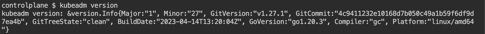
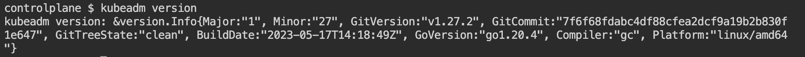
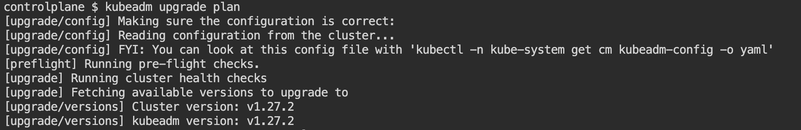
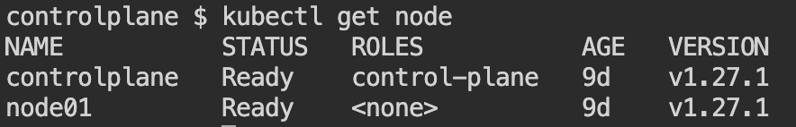
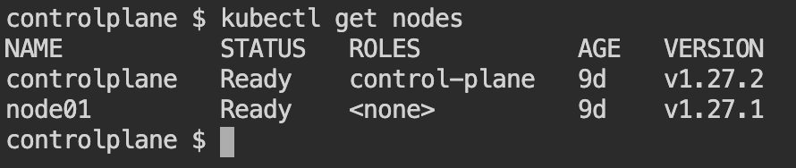

> <strong>Useful Resources</strong>: [Cluster Upgrade](https://kubernetes.io/docs/tasks/administer-cluster/kubeadm/kubeadm-upgrade/)

For this question, please set this context (In exam, diff cluster name)

`kubectl config use-context kubernetes-admin@kubernetes`{{exec}}

 

Upgrade `controlplane` node `kubeadm`, `cluster` and `kubelet` to next version.

EXAMPLE: If current version is `v1.27.1` then upgrade to `v1.27.2`

***********
|`kubeadm`|
***********

BEFORE UPGRADE: ( `v1.27.1` )

AFTER UPGRADE: ( `v1.27.2` )

*******************
|`Cluster Upgrade`|
*******************

BEFORE UPGRADE: ( `v1.27.1` )

AFTER UPGRADE: ( `v1.27.2` )

*******************
|`kubelet Upgrade`|
*******************

BEFORE UPGRADE: ( `v1.27.1` )

AFTER UPGRADE: ( `v1.27.2` )

Similarly verify upgradation for current verion. ( ex:- `v1.27.1` to `v1.27.2` )